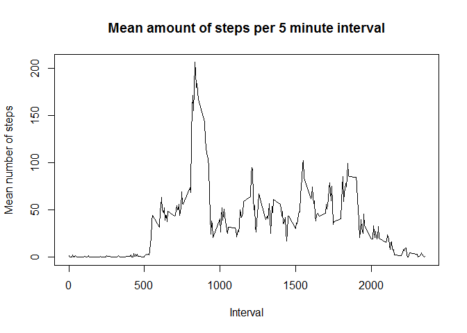
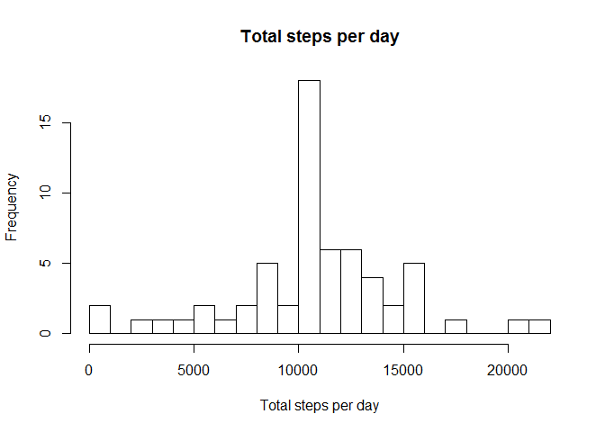

# Reproducible Research: Peer Assessment 1


## Loading and preprocessing the data
The data is loaded using a simple csv read. The preprocessing only concerns converting the date from a string type.

```r
activity <- read.csv("activity.csv", stringsAsFactors = FALSE)
activity$date <- as.Date(strptime(activity$date, "%Y-%m-%d")) 
```

## What is mean total number of steps taken per day?
The total number of steps per day can be calculated by aggregating the steps by date. A list is given below.

```r
steps.per.day <- aggregate(activity$steps, by = list(Date = activity$date), FUN = sum)
steps.per.day
```

```
##          Date     x
## 1  2012-10-01    NA
## 2  2012-10-02   126
## 3  2012-10-03 11352
## 4  2012-10-04 12116
## 5  2012-10-05 13294
## 6  2012-10-06 15420
## 7  2012-10-07 11015
## 8  2012-10-08    NA
## 9  2012-10-09 12811
## 10 2012-10-10  9900
## 11 2012-10-11 10304
## 12 2012-10-12 17382
## 13 2012-10-13 12426
## 14 2012-10-14 15098
## 15 2012-10-15 10139
## 16 2012-10-16 15084
## 17 2012-10-17 13452
## 18 2012-10-18 10056
## 19 2012-10-19 11829
## 20 2012-10-20 10395
## 21 2012-10-21  8821
## 22 2012-10-22 13460
## 23 2012-10-23  8918
## 24 2012-10-24  8355
## 25 2012-10-25  2492
## 26 2012-10-26  6778
## 27 2012-10-27 10119
## 28 2012-10-28 11458
## 29 2012-10-29  5018
## 30 2012-10-30  9819
## 31 2012-10-31 15414
## 32 2012-11-01    NA
## 33 2012-11-02 10600
## 34 2012-11-03 10571
## 35 2012-11-04    NA
## 36 2012-11-05 10439
## 37 2012-11-06  8334
## 38 2012-11-07 12883
## 39 2012-11-08  3219
## 40 2012-11-09    NA
## 41 2012-11-10    NA
## 42 2012-11-11 12608
## 43 2012-11-12 10765
## 44 2012-11-13  7336
## 45 2012-11-14    NA
## 46 2012-11-15    41
## 47 2012-11-16  5441
## 48 2012-11-17 14339
## 49 2012-11-18 15110
## 50 2012-11-19  8841
## 51 2012-11-20  4472
## 52 2012-11-21 12787
## 53 2012-11-22 20427
## 54 2012-11-23 21194
## 55 2012-11-24 14478
## 56 2012-11-25 11834
## 57 2012-11-26 11162
## 58 2012-11-27 13646
## 59 2012-11-28 10183
## 60 2012-11-29  7047
## 61 2012-11-30    NA
```

The mean number of steps per day is then calculated by applying the mean function, disregarding NA values.

```r
hist(steps.per.day$x, breaks = 16, xlab = "Total steps per day", main = "Total steps per day")
```

<!-- -->

```r
mean(steps.per.day$x, na.rm = TRUE)
```

```
## [1] 10766.19
```

```r
median(steps.per.day$x, na.rm = TRUE)
```

```
## [1] 10765
```
As can be seen, the mean and the median are quite close, and both are somewhat over 10000 steps per day.

## What is the average daily activity pattern?
The average daily pattern can be discovered by aggregating the number of steps by 5 minute interval. Again, missing values have been ignored. 

```r
steps.per.interval <- aggregate(activity$steps, by = list(Interval = activity$interval), FUN = mean, na.rm = TRUE)
plot(y = steps.per.interval$x, 
     x = steps.per.interval$Interval, 
     type = "l", 
     xlab = "Interval", 
     ylab = "Mean number of steps", 
     main = "Mean amount of steps per 5 minute interval")
```

<!-- -->

```r
steps.per.interval[which.max(steps.per.interval$x),]$Interval
```

```
## [1] 835
```
The resulting plot demonstrates, that most steps are made between 8:35AM and 8:40AM. 

## Imputing missing values
A total of 2304 values are missing in the dataset. 

```r
sum(is.na(activity$steps))
```

```
## [1] 2304
```

In the further analysis, all missing data points were replaced by the mean value for the given interval, over the entire data set. The following code has been run to achieve this:

```r
activity.no.na <- activity
missing.entries <- is.na(activity$steps)
missing.intervals <- activity.no.na[is.na(activity$steps),]$interval
myfunc <- function(x) {steps.per.interval[steps.per.interval$Interval == x, "x"]}
missing.steps <- sapply(missing.intervals, myfunc)
activity.no.na[is.na(activity$steps),]$steps <- missing.steps
steps.per.day.no.na <- aggregate(activity.no.na$steps, by = list(Date = activity.no.na$date), FUN = sum)
```

The metrics for the resulting data set resemble the metrics for the original set quite closely: 

```r
hist(steps.per.day.no.na$x, breaks = 16, xlab = "Total steps per day", main = "Total steps per day")
```

<!-- -->

```r
mean(steps.per.day.no.na$x, na.rm = TRUE)
```

```
## [1] 10766.19
```

```r
median(steps.per.day.no.na$x, na.rm = TRUE)
```

```
## [1] 10766.19
```
As can be seen, the median number of steps in the adjusted data set is equal to the mean number of steps.  

## Are there differences in activity patterns between weekdays and weekends?
In order to compare activity patterns in weekdays and weekends, a new factor is created for the activity data set. An aggregate is taken by 5 minute interval, and by the factors weekday/weekend.   

```r
Sys.setlocale("LC_TIME", "English")
```

```
## [1] "English_United States.1252"
```

```r
activity.no.na$in.weekend <- as.factor(weekdays(activity.no.na$date) %in% c("Saturday", "Sunday"))
levels(activity.no.na$in.weekend) <- c("Weekday","Weekend")
steps.per.interval.no.na <- aggregate(activity.no.na$steps, 
                                by = list(Interval = activity.no.na$interval, 
                                          In.Weekend = activity.no.na$in.weekend), 
                                FUN = mean, 
                                na.rm = TRUE)
```

The following graphs compare the activity patterns between weekdays and weekends. It can be seen that:  

* In weekends, the test person seems to wake up later than on weekdays.  
* In weekdays, steps during commuting hours are higher.  
* In weekends, steps outside commuting hours are usually somewhat higher.  


```r
library(ggplot2)
g <- ggplot(data = steps.per.interval.no.na, aes(x = Interval, y = x))
g + geom_point() + 
    facet_grid(In.Weekend~.) +
    ylab("Steps") +
    ggtitle("Mean amount of steps per 5 minute interval")
```

<!-- -->
